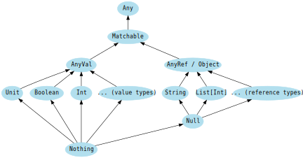

###### Type Heirarchy in Scala 3

##### All values have a type
In Scala, all values have a type, including numerical values and functions.

##### Type casting

##### Nothing and null
`Nothing` is a subtype of all types, also called the bottom type. There is no value that has the type `Nothing`. A common use is to signal non-termination, such as a thrown exception, program exit, or an infinite loop—i.e., it is the type of an expression which does not evaluate to a value, or a method that does not return normally.

`Null` is a subtype of all reference types (i.e. any subtype of AnyRef). It has a single value identified by the keyword literal `null`. Currently, the usage of null is considered bad practice. It should be used mostly for interoperability with other JVM languages. An opt-in compiler option changes the status of `Null` to fix the caveats related to its usage. This option might become the default in a future version of Scala. You can learn more about it here.

In the meantime, `null` should almost never be used in Scala code.
